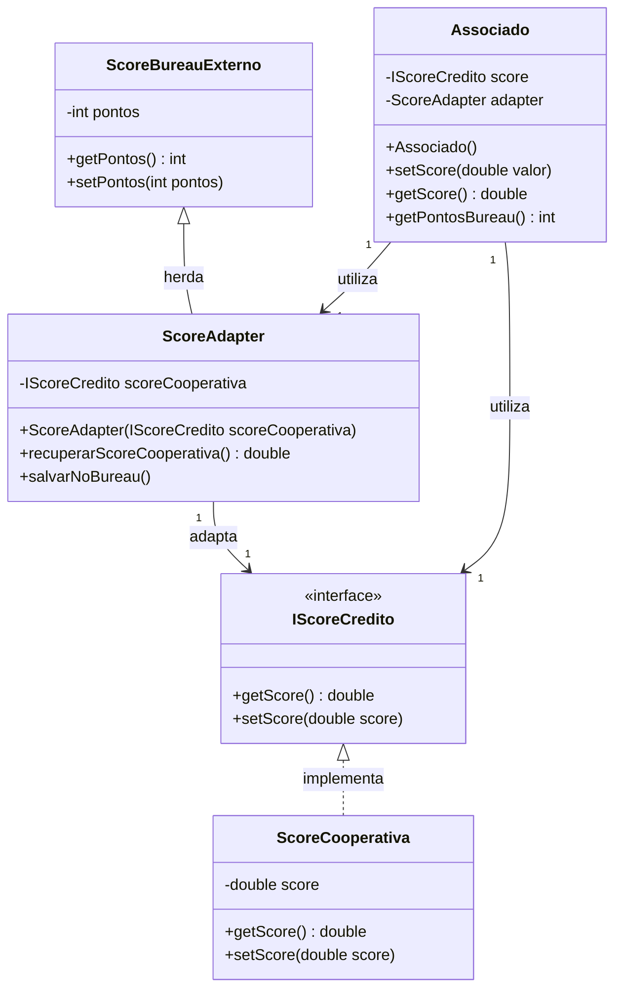

diagrama:

```mermaid
classDiagram
    class IScoreCredito {
        <<interface>>
        +getScore() double
        +setScore(double score)
    }

    class ScoreCooperativa {
        -double score
        +getScore() double
        +setScore(double score)
    }

    class ScoreBureauExterno {
        -int pontos
        +getPontos() int
        +setPontos(int pontos)
    }

    class ScoreAdapter {
        -IScoreCredito scoreCooperativa
        +ScoreAdapter(IScoreCredito scoreCooperativa)
        +recuperarScoreCooperativa() double
        +salvarNoBureau()
    }

    class Associado {
        -IScoreCredito score
        -ScoreAdapter adapter
        +Associado()
        +setScore(double valor)
        +getScore() double
        +getPontosBureau() int
    }

    IScoreCredito <|.. ScoreCooperativa : implementa
    ScoreBureauExterno <|-- ScoreAdapter : herda
    ScoreAdapter "1" --> "1" IScoreCredito : adapta
    Associado "1" --> "1" IScoreCredito : utiliza
    Associado "1" --> "1" ScoreAdapter : utiliza

```
